<!-- ============================================================= -->
<!--  PROFILE README — fahimnafis2025                              -->
<!-- ============================================================= -->

<p align="center">
  
</p>

<p align="center">
  <a href="https://linkedin.com/in/fahimnafis"></a>
  <a href="mailto:fahimnafis2022@gmail.com"></a>
  
  
  
</p>

---

## whoami

```text
$ whoami
MD Fahim Nafis — Security Automation Engineer / SOC & Detection Engineer
```

> I build the **first ten minutes of an analyst's day** as code — SIEM detection, SOAR pipelines, and AI-assisted triage that turn a raw alert into a decision-ready case.

- **M.Sc Cybersecurity** — Fordham University · **B.Sc Computer Science & Engineering** — BRAC University
- **Graduate Research Assistant** @ Fordham — ML-based intrusion detection research
- **IEEE-published** author · **3 research papers** across intrusion detection & applied ML security
- Associate Member, **Sigma Xi** Scientific Research Honor Society
- Based in **New York** — open to hybrid or on-site, authorized to work in the U.S. (EAD)

---

<p align="center">
  
</p>

---

## The knowledge graph

Two degrees, two worlds — **Computer Engineering** and **Cybersecurity** — branching into nine domains and the tools I actually run. Every node is hands-on, from graduate coursework or shipped projects.

<p align="center">
  
</p>

---

<p align="center">
  
</p>

---

## Featured project — SOC Automation Lab

> **[github.com/fahimnafis2025/soc-automation-splunk-dfriris](https://github.com/fahimnafis2025/soc-automation-splunk-dfriris)**

An end-to-end SOAR pipeline that reduces L1 alert fatigue. A real Windows attack is detected in Splunk, enriched with threat intel, triaged by an AI analyst, and lands as a decision-ready case — **before a human ever looks at it.**

```text
Windows ─▶ Splunk ─▶ Cloudflare Tunnel ─▶ n8n ─▶ VirusTotal + AbuseIPDB ─▶ Gemini ─▶ Slack + DFIR-IRIS
```

The AI triage is **guard-railed to stay honest** — it separates confirmed facts from inference, refuses to claim a compromise it can't prove, and maps only directly-supported MITRE ATT&CK techniques. Free-tier and self-hosted throughout.

---

## More projects

| Project | What it does | Stack |
|---|---|---|
| **Cloud-Native SOC & IR Lab** | Cloud-native SOC in Azure: ingested 1,200+ daily endpoint logs into Microsoft Sentinel, authored KQL analytic/hunting rules mapped to MITRE ATT&CK, automated containment with SOAR playbooks. | Azure · Sentinel · Defender XDR · KQL · Logic Apps |
| **8B-LLM Prompt-Injection Automation** | Automated red-teaming framework for testing 8B-parameter self-hosted LLMs against prompt-injection & agent-hijacking attacks. | Python · Self-hosted LLMs · Ollama |
| **Few-Shot Intrusion Detection** *(IEEE)* | Siamese networks + few-shot learning on CICIDS-2017 for zero-day detection. | Python · PyTorch |
| **WiFi CSI Biometrics** | Privacy-preserving human identification from WiFi Channel State Information — submitted to KES 2026. | Python · ML frameworks |
| **Adversarial ML Study** | Data-poisoning attacks against SVM / Logistic Regression / LeNet / ResNet / ViT on CIFAR-10 & MNIST. | Python · PyTorch |

---

## What I'm about

- **Detection engineering over dashboards.** A good detection that fires clean beats ten noisy ones. I tune for signal.
- **Automation that stays honest.** My AI-triage pipelines are guard-railed to separate confirmed facts from inference — a SOAR flow that overclaims is worse than none.
- **Homelab-first.** I learn by building the real thing on free tiers and writing the click-by-click docs so others can replicate it.
- **Full-spectrum, not siloed.** Blue-team detection, offensive validation, digital forensics, and the governance/risk context that ties it all together.

---

## Beyond the resume

- **Continuous hands-on reps** on Hack The Box, TryHackMe, Blue Team Labs Online, and LetsDefend — offense and defense both.
- **Research honor society** (Sigma Xi) member — I like problems that don't have a Stack Overflow answer yet.
- **I write the docs I wish I'd had** — beginner-friendly, click-by-click, real screenshots, honest troubleshooting.

---

<p align="center">
  
  
</p>

<p align="center"><sub>"Zero Trust isn't paranoia when the logs keep proving you right."</sub></p>
