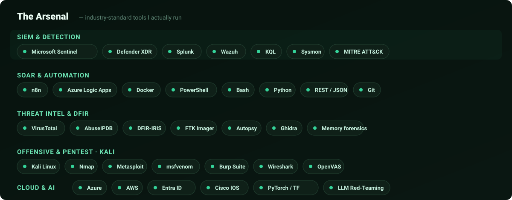

<!-- ============================================================= -->
<!--  PROFILE README — fahimnafis2025                              -->
<!-- ============================================================= -->

<p align="center">
  
</p>

<p align="center">
  <a href="https://linkedin.com/in/fahimnafis"></a>
  <a href="mailto:fahimnafis2022@gmail.com"></a>
  
  
</p>

---

## whoami

```text
$ whoami
MD Fahim Nafis — Security Automation Engineer / SOC & Detection Engineer
```

I build the **first ten minutes of an analyst's day** as code. My focus is the blue-team automation layer: SIEM detection engineering, SOAR pipelines, threat-intel enrichment, and AI-assisted triage — the plumbing that turns a raw alert into a decision-ready case before a human ever looks at it.

- **M.Sc Cybersecurity** — Fordham University (4.0 GPA) · **B.Sc CSE** — BRAC University
- **Graduate Research Assistant** @ Fordham — ML-based intrusion detection research
- **IEEE-published**: *Few-Shot Intrusion Detection Using Siamese Networks for Zero-Day Threats* (WF-PST 2025)
- Associate Member, **Sigma Xi** Scientific Research Honor Society
- **CompTIA Security+** & **Microsoft SC-200** — in progress (exams scheduled)
- Based in **Long Island, NY** — open to hybrid or on-site, authorized to work in the U.S. (EAD)

---

<p align="center">
  
</p>

---

<p align="center">
  
</p>

---

## Highlight projects

| Project | What it does | Stack |
|---|---|---|
| **[SOC Automation Lab](https://github.com/fahimnafis2025/soc-automation-splunk-dfriris)** | End-to-end SOAR pipeline: detects a real Windows attack, enriches with VirusTotal + AbuseIPDB, triages with an AI analyst, and lands a decision-ready case in Slack + DFIR-IRIS. Free-tier throughout. | Splunk · n8n · VirusTotal · AbuseIPDB · Gemini · DFIR-IRIS |
| **Cloud-Native SOC & IR Lab** | Architected a cloud-native SOC in Azure: ingested 1,200+ daily endpoint logs into Microsoft Sentinel, authored KQL analytic/hunting rules mapped to MITRE ATT&CK, and automated containment with SOAR playbooks. | Azure · Sentinel · Defender XDR · KQL · Logic Apps |
| **8B-LLM Prompt-Injection Automation** | Automated red-teaming framework for testing 8B-parameter self-hosted LLMs against prompt-injection attacks. | Python · Self-hosted LLMs |
| **Few-Shot Intrusion Detection** *(IEEE)* | Siamese networks + few-shot learning on CICIDS-2017 for zero-day detection — 97% test accuracy, 35% reduction in false-positive triage time. | Python · ML frameworks |
| **WiFi CSI Biometrics** | Privacy-preserving human identification/authentication from WiFi CSI signals — submitted to KES 2026. | Python · ML frameworks |

---

## What I'm about

- **Detection engineering over dashboards.** A good detection that fires clean beats ten noisy ones. I tune for signal.
- **Automation that stays honest.** My AI-triage pipelines are guard-railed to separate confirmed facts from inference — a SOAR flow that overclaims is worse than none.
- **Homelab-first.** I learn by building the real thing on free tiers and writing the click-by-click docs so others can replicate it.

---

## GitHub stats

<p align="center">
  
  
</p>

<p align="center">
  
</p>

---

<p align="center"><sub>"Securing networks and LLMs — one homelab experiment at a time."</sub></p>
